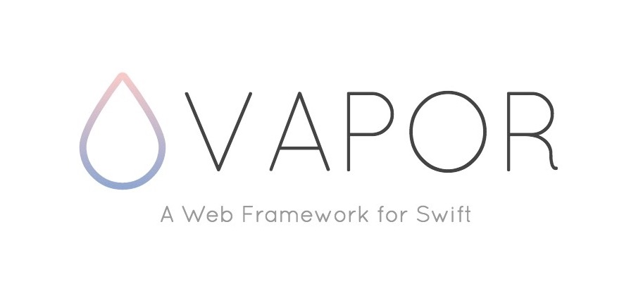

  

## :cake: Introduction

Hey! Welcome to my practice area! At the moment I'm an iOS Developer and want to be more versatile. So, for that purpose, I've started to improve knowledge of server side.

This Readme will describe step by step my acquaintance with framework named as Vapor. 

Welcome!

## :lollipop: Ray Wenderlich screencasts (Server Side Swift with Vapor)

- [Getting Started](https://videos.raywenderlich.com/screencasts/server-side-swift-with-vapor-getting-started)
- [Templating with Leaf](https://videos.raywenderlich.com/screencasts/server-side-swift-with-vapor-templating-with-leaf)
- [Configuring a Database](https://videos.raywenderlich.com/screencasts/server-side-swift-with-vapor-configuring-a-database)
- [Persisting Models](https://videos.raywenderlich.com/screencasts/server-side-swift-with-vapor-persisting-models)
- [CRUD Database Options](https://videos.raywenderlich.com/screencasts/server-side-swift-with-vapor-crud-database-options)
- [Deploying to Heroku with PostgreSQL](https://videos.raywenderlich.com/screencasts/server-side-swift-with-vapor-deploying-to-heroku-with-postgresql)
- [Basic Controllers](https://videos.raywenderlich.com/screencasts/server-side-swift-with-vapor-basic-controllers)
- [RESTful Controllers](https://videos.raywenderlich.com/screencasts/server-side-swift-with-vapor-restful-controllers)
- [Beautifying Pages with Skeleton](https://videos.raywenderlich.com/screencasts/server-side-swift-with-vapor-beautifying-pages-with-skeleton)
- [Making a Web App](https://videos.raywenderlich.com/screencasts/server-side-swift-with-vapor-making-a-web-app)
- [Basic Validation](https://videos.raywenderlich.com/screencasts/server-side-swift-with-vapor-basic-validation)
- [Custom Validation](https://videos.raywenderlich.com/screencasts/server-side-swift-with-vapor-custom-validation)
- [Parent-Child Relations](https://videos.raywenderlich.com/screencasts/server-side-swift-with-vapor-parent-child-relations)
- [Sibling Relations](https://videos.raywenderlich.com/screencasts/server-side-swift-with-vapor-sibling-relations)
- [Registering Users over SSL](https://videos.raywenderlich.com/screencasts/server-side-swift-with-vapor-registering-users-over-ssl)

## :cookie: Documentation

Visit the Vapor web framework's [documentation](http://docs.vapor.codes) for instructions on how to use this package.

## :chocolate_bar: Community

Join the welcoming community of fellow Vapor developers in [slack](http://vapor.team).
